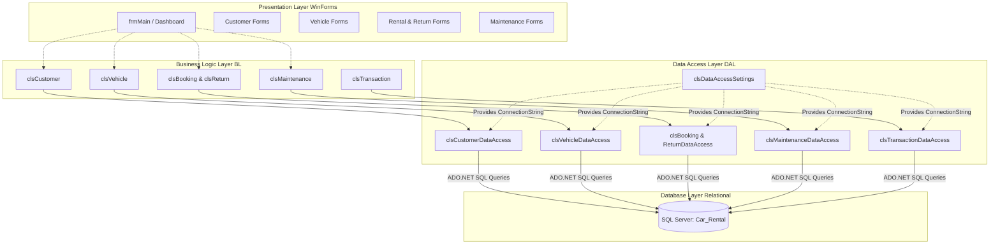

# csharp-car-rental-management-system
C# WinForms Car Rental Management System using ADO.NET, SQL Server, and 3-tier architecture for managing customers, vehicles, rentals, returns, maintenance, and transactions.


# 🚗 Premium Car Rental Management System

[](https://docs.microsoft.com/en-us/dotnet/csharp/)
[](https://dotnet.microsoft.com/)
[](https://www.microsoft.com/en-us/sql-server/)
[](#architecture)
[](#ui-aesthetics)

Welcome to the **Premium Car Rental Management System**—a high-performance, robust, and feature-rich desktop application engineered in **C# Windows Forms** using a strict **3-Tier Architecture** and direct **ADO.NET** data access against **Microsoft SQL Server**.

This solution delivers a state-of-the-art administrative hub for vehicle fleet operations, customer profiles, rental agreements, return tracking, financial invoicing, and equipment maintenance.

---

## 🏛️ Architecture

The system enforces a clean separation of concerns using a **3-tier architecture**. Each layer is isolated to ensure maximum maintainability, scalability, and code testability.



### Layer Responsibilities
*   **Presentation Layer (`CarRental`):** Houses the user interface forms and custom graphics logic. It handles all direct user interactions, displays rich data tables, and collects form inputs.
*   **Business Layer (`BusinessLayer`):** Coordinates logic, validates actions (such as checking vehicle availability during booking), handles modes (`AddNew` vs `Update`), and encapsulates business state before saving.
*   **Data Access Layer (`DataAccessLayer`):** Interfaces with SQL Server via direct, parameter-safe ADO.NET (`SqlConnection`, `SqlCommand`, `SqlDataReader`, etc.), keeping database queries completely isolated from the business rules.

---

## ✨ Features

The system comes loaded with fully implemented modules to run a full-scale rental business:

### 👤 Customer Management
*   **Detailed Profiles:** Track customer name, contact details, driver license number, and upload avatar/profile pictures.
*   **Search & Filters:** Instantly find records using quick search.

### 🚘 Fleet (Vehicle) Management
*   **Detailed Classifications:** Group vehicles by Make, Model, Year, Category (Sedan, SUV, Luxury, Sports, Hatchback), and Fuel Type.
*   **Fleet Status:** Automated availability tracking (`IsAvailableForRent` bit toggling).
*   **Visual Assets:** Store vehicle images dynamically.

### 📅 Smart Rental Bookings
*   **Real-time Validations:** Prevents double-booking by only displaying available vehicles.
*   **Automated Calculations:** Automatically computes rental duration (days) and total due amount based on individual vehicle daily rates.
*   **Detailed Logs:** Input custom pickup/drop-off locations and check notes.

### ↩️ Vehicle Returns & Check-In
*   **Odometer Tracking:** Consumed mileage is auto-calculated upon return and the vehicle's odometer is automatically updated in the database.
*   **Penalty Assessments:** Calculates delay periods and applies extra fees or additional charges.
*   **Fleet Re-Integration:** Instantly updates vehicle status back to `Available` upon successful return.

### 💳 Transaction Auditing
*   **Financial Auditing:** Keeps ledger of transaction details, actual dues, paid amounts, payment methods, and auto-calculates remaining balances or refunds.

### 🛠️ Maintenance & History logs
*   **Maintenance Tickets:** Log vehicles in for repairs, describing issues and tracking repair costs.
*   **Automatic Status Lock:** Vehicles placed under maintenance are locked and cannot be rented.
*   **Historical Archive:** Once maintenance is marked complete, records are cleanly transferred to the historical log (`VehicleMaintenanceHistory`) for clean auditing.

---

## 🎨 UI Aesthetics

The user interface goes beyond typical grey Windows Forms applications by implementing modern, state-of-the-art UX principles:
*   **Harmony Palette:** Features a premium slate-dark and neon-blue color system.
*   **GDI+ Paint Effects:** The main dashboard header panel (`pnlHeader`) is customized using premium GDI+ linear gradient brushes (`pnlHeader_Paint`) and smooth vector curves with anti-aliasing.
*   **Micro-Animations:** Hover transitions (`Button_MouseEnter` / `Button_MouseLeave`) change background and foreground colors dynamically for highly responsive feedback.

---

## 🗄️ Database Schema

The relational database consists of 13 interconnected tables and optimized views:
*   `Users` (Internal authentication credentials)
*   `Makes`, `Models`, `FuelTypes`, `VehicleCategories` (Standardized lookup tables)
*   `Car_Details` (Handles relationships between make-model combinations)
*   `Vehicles` (Core vehicle registry)
*   `Customer` (Core customer profiles)
*   `RentalBooking` & `VehicleReturns` (The operational core)
*   `RentalTransaction` (Financial records)
*   `VehicleMaintenance` & `VehicleMaintenanceHistory` (Maintenance pipelines)
*   `vw_ActiveBookings` (Optimized SQL View for active contracts)

The entire setup script including predefined seed data is located in:
🔗 **[schema.sql](file:///d:/CarRentalSolution/schema.sql)**

---

## 🚀 Getting Started

Follow these steps to deploy and run the application locally.

### 📋 Prerequisites
*   **Visual Studio** (2019 or 2022 recommended) with the **.NET Desktop Development** workload installed.
*   **Microsoft SQL Server** (Express or Developer Edition).
*   **SQL Server Management Studio (SSMS)** to execute the database script.

---

### 🛠️ Installation & Setup

#### Step 1: Database Deployment
1.  Open **SQL Server Management Studio (SSMS)** and connect to your SQL Server instance.
2.  Open the [schema.sql](file:///d:/CarRentalSolution/schema.sql) file.
3.  Execute the script (`F5` or click **Execute**) to automatically build the database structure, set up foreign keys, compile views, and seed default lookup values, customers, and vehicles.

#### Step 2: Connection String Configuration
1.  In Visual Studio, open the solution file `CarRental.sln`.
2.  Navigate to the `DataAccessLayer` project and open [clsDataAccessSettings.cs](file:///d:/CarRentalSolution/DataAccessLayer/clsDataAccessSettings.cs).
3.  Replace the `ConnectionString` string with your SQL Server target credentials:
    ```csharp
    public static string ConnectionString = "Server=YOUR_SERVER_NAME;Database=Car_Rental;User Id=YOUR_USER;Password=YOUR_PASSWORD;";
    // Or if you use Integrated Windows Authentication:
    // public static string ConnectionString = "Server=.;Database=Car_Rental;Trusted_Connection=True;";
    ```

#### Step 3: Run the Application
1.  Set `CarRental` (the WinForms project) as the **Startup Project** in Visual Studio.
2.  Press **Start** (`F5`) or click **Debug -> Start Debugging**.

---

## 🔑 Default Credentials

To explore the dashboard, log in with these pre-seeded administrator credentials:

> [!IMPORTANT]
> *   **Username:** `admin`
> *   **Password:** `1234`

---

## 🛡️ Security Best Practices
*   **Parameterization:** All queries executed through the `DataAccessLayer` use SQL Parameterization (`Parameters.AddWithValue`) to completely insulate the database from SQL Injection attacks.
*   **Separation of Concerns:** Business logic rules are checked only inside the Business Layer, ensuring data consistency before reaching the storage layers.

---

